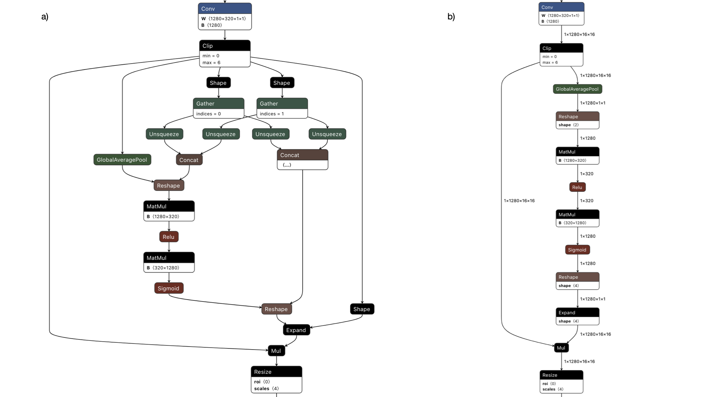

# Image matting
* Automatically extracting the alpha matte via deep learning

<!-- TABLE OF CONTENTS -->
## Table of Contents

* [About the project](#about-the-project)
  * [Built with](#built-with)
* [Getting started](#getting-started)
  * [The story so Far](#the-story-so-far)
  * [Notebooks](#notebooks)
    * [MODNet](#modnet)
    * [Inference](#inference)
  * [Scripts](#scripts)
* [Discussion and conclusion](#discussion-and-conclusion)
* [Acknowledgement](#acknowledgement)
* [Citation](#citation)

<!-- ABOUT THE PROJECT -->
## About The Project
Image matting is the research area that algorithms can accurately extract the foreground object of the corresponding photos or videos. The following figure illustrates one sample inference. The predicted alpha matte(middle) can further used for extracting the foreground object(left) from the original image(right).

<figure align="center">
  
  <figcaption>Figure 1. Illustration of image matting.</figcaption>
</figure>

Based on the extracted foreground objects, many interesting tasks can be further achieved. For example, using a specific recommendation system, it is plausible to match a dress with a hat, shoes and even accessories based on some customized requests. This project focused on the image matting procedure.
 <!-- For more information, please check [MODNet](https://github.com/ZHKKKe/MODNet) -->

### Built With

* [MODNet](https://github.com/ZHKKKe/MODNet)
* [PyTorch](https://pytorch.org/)
* [OpenCV](https://opencv.org/)
* [ONNX](https://onnx.ai/)
* [Tensorflow](https://www.tensorflow.org/)
* [TesnorRT](https://developer.nvidia.com/tensorrt)
<!-- * [U-2-Net](https://github.com/xuebinqin/U-2-Net) -->


<!-- GETTING STARTED -->
## Getting Started

### The Story So Far

MODNet was originally designed for portrait matting. Here, we adapted the architecture of MODNet to the domain of clothing matting, aiming to extract the clothing foreground object from daily photos for next step of recommendation system. The model predicts well on the categories including: hats, skirt, shoes, dresses, shorts, blouses, hoodies, jeans, etc. Some of the mentioned items are shown in Figure 2.

<figure align="center">
  
  <figcaption>Figure 2. Foreground object, alpha matte, and the original image in each sub-figure are presented belong to different categories and backgrounds.</figcaption>
</figure>

Except for the ability of predicting variety of clothes, it is shown that the algorithm can handle diverse backgrounds, e.g. flatly placing items on the ground/sheet, or hanging items in front of door/wall, even  a low contrast image which is illustrated in the first sub-figure of Figure 2.

### notebooks

#### MODNet

  1. [MODNet sandboxed training](https://github.com/peace-and-harmony/image-matting/blob/main/notebooks/MODNet_train.ipynb) - An illustration of how to train MODNet on the customized training dataset whether via an Ipython interactive environment, local machine or vm instance. The related scripts contain loading data along with allowing a user to continue training from stored session from the command line.

  - Implementation of customized PyTorch based transforms
  - Initialization from a pre-trained backbone
  - The ability to resume after a stopped session
  - Storing and plotting the loss vs epoch relationship via tensorboard

  2. [MODNet eval](https://github.com/peace-and-harmony/image-matting/blob/main/notebooks/MODNet_eval.ipynb) - This notebook provides evaluation procedure on validation set or test set via loading saved checkpoint. The accuracy metrics is based on the Mean Intersection-Over-Union (MIoU).

  - Guid through down loading Kaggle clothing dataset for test
  - To evaluate the model performance via Mean IoU metrics
  - Display the inference images

#### Inference

1. [MODNet quick inference](https://github.com/peace-and-harmony/image-matting/blob/main/notebooks/modnet_quick_inference.ipynb) - This notebook provides a quick test inference on your image via the pre-trained checkpoint.

- A quick instruction for using the algorithm to perform foreground object extraction
- Uploading the customized images
- Performing inference and display the corresponding combined results

2. [MODNet demo - Benchmark](https://github.com/peace-and-harmony/image-matting/blob/main/notebooks/modnet_demo_benchmark.ipynb) - An initial on the rails demo
of the original MODNet implementation including a comparison of the average inference runtime between Pytorch and ONNX.

- Converting Pytorch model to the format of ONNX version
- Inference runtime test over Pytorch and ONNX via CPU
- Simplifying ONNX format using onnx-simplifier
- Inference runtime comparison between ONNX and ONNX simplified model

 **Note** Insert a table for the resulting benchmark.

3. [MODNet - ONNX - TensorRT](https://github.com/peace-and-harmony/image-matting/blob/main/notebooks/modnet_tensorrt.ipynb) - A full Tesnorflow/ Keras based run through of the huge speedup that can be yielded by utilizing some of the emerging intermediate representation platforms. The notebooks provides before and after latency benchmarks, guides the user through conversion and ultimately builds a tensort engine for device specific deployment.


### Scripts

This sections contains the training and evaluation scripts for MODNet.

## Discussion and conclusion

There were parallel research conducting aiming clothing matting together with the team members. One is the mentioned MODNet, the other is [U-2-Net](https://github.com/xuebinqin/U-2-Net).

During the weekly client meeting, we consistently compare, discuss the two models. It's interesting to find that U-2-Net is superior in terms of semantic prediction and robustness to the data augmentations. MODNet performs better on details(contour of the foreground object) prediction.

Based on the same device and same training size used for training, MODNet is quicker to train due to the lightweight architecture. For MODNet, 12 experiments were designed, including:

1. Implement different combination of data augmentations
- ColorJitter was used for predicting the low contrast image. For example, the very first sub-figure.
- Considering the foreground object from mobile photos might not be always the same direction. Random rotation was introduced for recognizing the tilt images. For example, the right bottom sub-figure. Whereas, when implementing rotation of the training samples and corresponding ground truths, the model loses the ability to predicts the straps of camisoles. This might due to the padding of the unknown area after rotation. Since a large increase of the MIoU, it is decided to include the random rotation.
- It is found that the overall loss is higher when incorporating random rotation which we think is also caused by the padding of the unknown area.
2. Different training sample sizes
- It is found that the U-2-Net kept improving the MIoU, while MODNet was not much sensitive to the size of the dataset after some specific number of samples.
3. Varying training strategies: scratch vs transfer learning
- The experiment with pre-trained weights indicated higher accuracy which was consistent with the result from MODNet author.
- Due to a large variety of categories of clothing, and small amount of accurately annotated training samples, the model only performed well for some specific types of clothing.
4. Fine-tuning
- In one experiment, the backbone was fine-tuned after 115(total 156) layers. The accuracy improved less than 1%.
5. Sub-objective consistency(SOC) adaption proposed by MODNet author
- The Sub-objective consistency belongs to semi-supervised learning. We applied SOC for the stored checkpoint. It is found that the MIoU is slightly decreased compared with MODNet weights. After careful checking of some results, we found that some predictions were improved via SOC adaption and some predictions were actually degraded after SOC. The mechanism of SOC strategy is to decrease the entropy between the predicted semantics and matte of the unlabeled data during training. Due to large amount of clothing types and lack of training samples mentioned in above discussion, it might be hard to reach the point that the SOC strategy can really help to improved the performance.
- Among the decomposed branches, the semantic prediction branch largely determine the final matte prediction. Hence, the high accuracy of the semantic prediction is critic for the SOC strategy which further might boost the accuracy matrics.

According to the evaluation result and testing inference, we found the experiment with aggressive data augmentations and portrait matting pre-trained weights provided by MODNet author demonstrates the highest accuracy which is measured via MIoU: 0.936.

[ONNX simplifier](https://github.com/daquexian/onnx-simplifier) was further used for simplifying the model. Author claim that the method is used to replace the verbose operators with the constant outputs. It's interesting to visualize computation graph after applying the simplifier to MODNet. The comparison between original architecture and simplified one is presented in Figure 3.

<figure align="center">
  
  <figcaption>Figure 3. Comparison of the simplified part of the model graph using ONNX simplifier.</figcaption>
</figure>


As a conclusion, MODNet is trained quicker, and correspondingly has short inference runtime which is due to the decomposed image matting architecture.  Meanwhile, MODNet is good at detail prediction(local features) because of the combination of attention mechanism and high resolution branch.
U-2-Net has a nested U-net architecture which renders relatively slow training and inference. However, due to the complexity of the model, U-2-Net performs well on semantic prediction.

# Acknowledgement

Thanks to @rhysdg for the overall guidance through the current project.

# Citation

```bibtex
@article{ke2020green,
  title={Is a Green Screen Really Necessary for Real-Time Portrait Matting?},
  author={Ke, Zhanghan and Li, Kaican and Zhou, Yurou and Wu, Qiuhua and Mao, Xiangyu and Yan, Qiong and Lau, Rynson WH},
  journal={arXiv preprint arXiv:2011.11961},
  year={2020}
}
```

```bibtex
@article{qin2020u2,
  title={U2-Net: Going deeper with nested U-structure for salient object detection},
  author={Qin, Xuebin and Zhang, Zichen and Huang, Chenyang and Dehghan, Masood and Zaiane, Osmar R and Jagersand, Martin},
  journal={Pattern Recognition},
  volume={106},
  pages={107404},
  year={2020},
  publisher={Elsevier}
}
```
