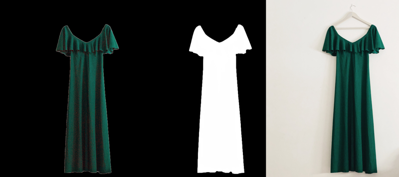

# Image matting
* Automatically extracting the alpha matte via deep learning

<!-- TABLE OF CONTENTS -->
## Table of Contents

* [About the project](#about-the-project)
  * [Built with](#built-with)
* [Getting started](#getting-started)
  * [The story so Far](#the-story-so-far)
  * [Notebooks](#notebooks)
    * [MODNet](#modnet)
    * [Inference](#inference)
  * [Scripts and tools](#scripts-and-tools)
* [Discussion and conclusion](#discussion-and-conclusion)

<!-- ABOUT THE PROJECT -->
## About The Project
Image matting is the research area that algorithms can accurately extract the foreground object of the corresponding photos or videos. The following figure illustrates one sample inference. The predicted alpha matte(middle) can further used for extracting the foreground object(left) from the original image(right).

<figure align="center">
  
  <figcaption>Figure 1. Illustration of image matting.</figcaption>
</figure>

Based on the extracted foreground objects, many interesting tasks can be further achieved. For example, using a specific recommendation system, it is plausible to match a dress with a hat, shoes and even accessories based on some customized requests. This project focused on the image matting procedure.
 <!-- For more information, please check [MODNet](https://github.com/ZHKKKe/MODNet) -->

### Built With

* [MODNet](https://github.com/ZHKKKe/MODNet)
* [PyTorch](https://pytorch.org/)
* [OpenCV](https://opencv.org/)
* [ONNX](https://onnx.ai/)
* [Tensorflow](https://www.tensorflow.org/)
* [TesnorRT](https://developer.nvidia.com/tensorrt)
<!-- * [U-2-Net](https://github.com/xuebinqin/U-2-Net) -->


<!-- GETTING STARTED -->
## Getting Started

### The Story So Far

MODNet was originally designed for portrait matting. Here, we adapted the architecture of MODNet to the domain of clothing matting, aiming to extract the clothing foreground object from daily photos for next step of recommendation system. The model predicts well on the categories including: hats, skirt, shoes, dresses, shorts, blouses, hoodies, jeans. Some of the mentioned items are shown in Figure 2.

<figure align="center">
  
  <figcaption>Figure 2. Foreground object, alpha matte, and the original image in each sub-figure are presented belong to different categories and backgrounds.</figcaption>
</figure>

Besides, it can be seen that the algorithms can handle varies backgrounds, e.g. flatly placing items on the ground/sheet, or hanging items in front of door/wall, even with a low contrast as shown in the first sub-figure.

### notebooks

#### MODNet

1. [MODNet sandboxed training](notebooks/MODNet_train.ipynb) - A illustration of how to train MODNet on the customized training dataset whether via an Ipython interactive environment, local machine or vm instance. The notebook contains loading data along with allowing a user to continue training from stored session from the command line.

- Implementation of customized PyTorch based transforms.
- Initialization from a pre-trained backbone.
- The ability to resume after a stopped session.

2. [MODNet eval](notebooks/MODNet_eval.ipynb) - This notebook provides evaluation procedure on validation set or test set via loading saved checkpoint. The accuracy metrics is based on the Mean Intersection-Over-Union (MIoU).

3. [MODNet quick inference](notebooks/modnet_pytorch_quick_inference) - This notebook provides a quick test inference on your image via the pre-trained ONNX version checkpoint when only CPU is available or using TensorRT inference when GPU is available for a speedup inference.


#### Inference

1. [MODNet demo - Benchmark](notebooks/modnet_demo_benchmark.ipynb) - An initial on the rails demo
of the original MODNet implementation including a comparison of the average inference runtime between Pytorch and ONNX.

- Converting Pytorch model to the format of ONNX version
- Inference runtime test over Pytorch and ONNX via CPU
- Simplifying ONNX format using onnx-simplifier
- Inference runtime comparison between ONNX and ONNX simplified model

 **Note** Insert a table for the resulting benchmark.

2. [MODNet - ONNX - TensorRT](notebooks/tensorrt/modnet_tensorrt.ipynb) - A full Tesnorflow/ Keras based run through of the huge speedup that can be yielded by utilizing some of the emerging intermediate representation platforms. The notebooks provides before and after latency benchmarks, guides the user through conversion and ultimately builds a tensort engine for device specific deployment.


### Scripts

This sections contains the training and evaluation scripts for MODNet.

## Discussion and conclusion

There were parallel research conducting aiming clothing matting together with the team members. One is the mentioned MODNet, the other is [U-2-Net](https://github.com/xuebinqin/U-2-Net).

During the weekly client meeting, we consistently compare, discuss the two models.

Based on the same device and same training size used for training, MODNet is quicker to train due to the lightweight architecture. For MODNet, 12 experiments were designed.

1. Different implementation of data augmentations
2. Different raining sample sizes, types
3. Varying training strategies: from scratch vs transfer learning
4. Fine-tuning
5. Sub-objective consistency adaption

[ONNX simplifier](https://github.com/daquexian/onnx-simplifier) was further used for simplifying the model.

<figure align="center">
  
  <figcaption>Figure 2. Foreground object, alpha matte, and the original image in each sub-figure are presented belong to different categories and backgrounds.</figcaption>
</figure>

As a conclusion, MODNet is trained quicker, and correspondingly has short inference runtime which is due to the decomposed image matting architecture. Whereas, MODNet is good at detail prediction(local features) because of the combination of attention mechanism and high resolution branch.
U-2-Net has a nested U-net architecture which renders slow training and inference. However, due to the complexity of the model, U-2-Net did really well on semantic prediction.


<!--
## Welcome to GitHub Pages

You can use the [editor on GitHub](https://github.com/peace-and-harmony/image-matting/edit/main/README.md) to maintain and preview the content for your website in Markdown files.

Whenever you commit to this repository, GitHub Pages will run [Jekyll](https://jekyllrb.com/) to rebuild the pages in your site, from the content in your Markdown files.

### Markdown

Markdown is a lightweight and easy-to-use syntax for styling your writing. It includes conventions for

```markdown
Syntax highlighted code block

# Header 1
## Header 2
### Header 3

- Bulleted
- List

1. Numbered
2. List

**Bold** and _Italic_ and `Code` text

[Link](url) and 
```

For more details see [GitHub Flavored Markdown](https://guides.github.com/features/mastering-markdown/).

### Jekyll Themes

Your Pages site will use the layout and styles from the Jekyll theme you have selected in your [repository settings](https://github.com/peace-and-harmony/image-matting/settings/pages). The name of this theme is saved in the Jekyll `_config.yml` configuration file.

### Support or Contact

Having trouble with Pages? Check out our [documentation](https://docs.github.com/categories/github-pages-basics/) or [contact support](https://support.github.com/contact) and we’ll help you sort it out. -->
