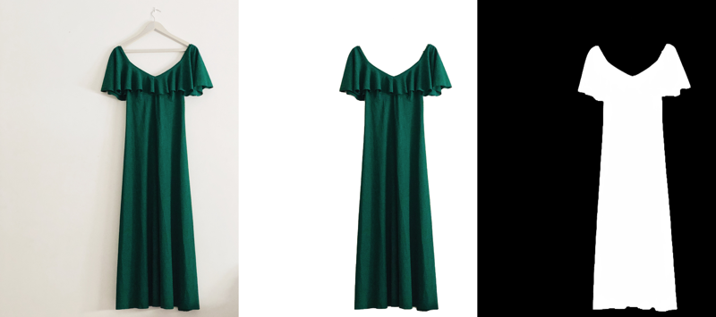

# Image matting
* Automatically extracting the alpha matte

<!-- TABLE OF CONTENTS -->
## Table of Contents

* [About the Project](#about-the-project)
  * [Built With](#built-with)
* [Getting Started](#getting-started)
  * [Prerequisites](#prerequisites)
  * [The Story so Far](#the-story-so-far)
  * [Notebooks](#notebooks)
    * [U2Net](#u2net)
    * [MODNet](#modnet)
    * [TensorRT](#tensorrt)
    * [Data Prep](#data-prep)
  * [Scripts and Tools](#scripts-and-tools)
  * [Research](#research)
  * [Reporting](#reporting)
  * [Supplementary Data](#supplementary-data)
* [Proposed Updates](#proposed-updates)
* [License](#license)
* [Contact](#contact)

<!-- ABOUT THE PROJECT -->
## About The Project

Image matting is the area that models can accurately extract the foreground object of the corresponding photos or videos. The produced alpha matte (right in Figure 1) can further used for extract the alpha matte (middle in Figure 1) from the original image(left in Figure 1).



### Built With

* [ONNX](https://onnx.ai/)
* [OpenCV](https://opencv.org/)
* [Tensorflow](https://www.tensorflow.org/)
* [PyTorch](https://pytorch.org/)
* [TesnorRT](https://developer.nvidia.com/tensorrt)
* [MODNet](https://github.com/ZHKKKe/MODNet)
<!-- * [U-2-Net](https://github.com/xuebinqin/U-2-Net) -->


<!-- GETTING STARTED -->
## Getting Started

### The Story So Far

After initial discussions I've gone ahead and thrown a couple of demos covering the areas we discussed, namely.

- Network latency improvement and portability
- Investigation of alternative cropping/matting techniques.
- Supporting data for exisitng models.

We'll use this repo as a quick reporting and show and tell landing point and we'll therefore aim to always have an annotated notebook showcasing a concept regardless of a user's hardware setup, providing a Google Colaboratory account is available. Should any modules/packages come into play, all necesary clarifications will appear in a sub-folder's readme or in a seperate repo should it becom an entire beast in itself.

For further infomration on the project overview please also see our [Confluence](https://beamdata-ai.atlassian.net/wiki/spaces/BE/overview?homepageId=28470575267) page as it becomes populated with information.


### Notebooks


All notebooks are primed for work, simply open a sandboxwitht he badge in the top left corner and follow the instructions cell by cell.

#### U2Net

Find a quick summary of the main demonstration notebooks below but go ahead and check out the dedicated u2net readme for further [Information](scripts/u2net/README.md)

1. [U-2-Net demo - Benchmark edition ](notebooks/u2net/u_2net_demo_benchmark_edition.ipynb) - An initial on the rails demo
of the original U2Net implementation including a Pyrtorch versus ONNX comparison benchmark. A guide as as to conversion to TensorRT and a subsequent benchmark.

 **Note** The notebook has recently been updated to demonstrate the usage of the initial u2net_onnx module from the command line and as an imported class.

 Please also see the `reporting` section for a single overview of all benchmarks.

2. [U2Net sandboxed training](notebooks/u2net/train-u2net.ipynb) - A brief runtrhough of what a training run looks like whether via an Ipython interactive environment, local machine or vm instance. The notebook guides the user through merging both the Fashionpedia and Pronti datsets, allows a user to switch between the original augs and or custom augs, along with allowing a user to continue training a stalled session from the command line.

 **Note** As with all U2Net notebooks please see the dedicated U2Net landing [page](scripts/u2net/README.md) for further insight into each module's usage

3. [U2Net eval](notebooks/u2net/eval-u2net.ipynb) - As the label describes on the tin the, follow the notebook's colab badge in order to receive an on the rails guide as to evaluation procedure with an active checkpoint. Further functionality includes:

 - Interactive handling of the original datset, the actively labelled clothing dataset, and Mila's representative images.
 - The ability to strip a training checkpoint ready for serving.
 - Interactive evaluation switching per datset, including a procedure robust to a scenario with no ground truths.
 - Interactive visualisation or the resultant images - Original image/probability map/cropped image concatenated.
 - The ability to export a satisfatory model to ONNX for quality asssessment.

4. [U2Net ONNX throughput investigation](notebooks/u2net/u2net_onnx_throughput.ipynb) - A sandboxed implementation of `u2net_onnx_mp.py` allowing the following:

 - Adjustment of a prepared onnx model to a chosen static batch.
 - Conversion of a provided datset to a base64 encoded string tagged by unique uuid, alternatively a prepared json is available via our shared [folder](https://drive.google.com/drive/folders/168swtLLjG722I2nzggNr2FCbVOS-1KqN?usp=sharing) based on the datset that's currently being labelled.
 - Mock implementation and streaming of incoming data. Allowing a user to either view per-batch benchmarks as they're available or visualise incoming cropped images decoded from the ouput base64 json.

 **Note** For demo purposes this implementation has been stripped from flask and simulates the scenario with a seperate thread feeding random chunks of the overall json. The concept still applies however should you wish to implement the module with Flask and a filesystem listener etc.

 Please also note that a breakdown of the module itself along with advanced usage can also be found at the U2Net landing [page](scripts/u2net/README.md) once again.


#### MODNet
1. [MODNet demo - Benchmark edition ](notebooks/modnet/modnet_demo_benchmark_edition.ipynb) - An on the rails runthrough and comparison benchmark between a Pytorch and ONNX implementation of MODNet including conversion to TensorRT and a subsequent benchmark.

2. [MODNet sandboxed training](notebooks/modnet/train_MODNet.ipynb) - A sandboxed runthrough of training and SOC procedure including:

 - Guided meging of both the Fashionpedia and Pronti dataset.
 - Implementation of custom PyTorch based transforms.
 - Initialisation from a pretrained backbone.
 - The ability to resume after a stalled or stopped session.

   **Note** Once again please the [reporting](reporting/README.md) section for an overrview of becnhmarks and experiemnts.

#### TensorRT

1. [Resnet50 - onnx - TensorRT](notebooks/tensorrt/resnet50_tensorrt.ipynb) - A full Tesnorflow/ Keras based run through of the huge speedup that can be yielded by utlising some of the emerging intermediate representation platforms. The notebooks provides before and after latency benchmarks, guides the user through conversion and ultimately builds a tensort engine for device specific deployment.

    **Note** that while ResNet50 is used here all available models have been verified within this woorkflow, it's therefore possoble to used advanced architectures suchas Efficientnet B7 for a fraction of the inference cost.

    It's also worth noting the findings here also apply to Pytorch with a few tweaks.

#### Data Prep

1. [Fashionpedia Exploration](notebooks/data-prep/fashionpedia_exploration.ipynb) - A demo overview of the preparation that went into converting the Fashionpedia instance segmentation datset into a binary segmentation task including:
 - Inital exporation and conversion to masks, including handling coco rle format annotations.

 - Combination of masks on a per image basis (the labels that were eventually merged with the original Pronti dataset).

 - Analysis of Class balance.

 **Note** Find both the instance task and combined masks prepared and available within the data sub-folder of our shared [folder](https://drive.google.com/drive/folders/1NDcYECRM3CqJaaWrmnnHWsI36VP7GksA?usp=sharing)

2. Open-Images Exploration (**Coming Soon**) - An overview of the relevant segmentation classes available  to us via Google's Open Images v6 dataset via Voxel's FiftyOne application. Currently relevant images stand at around 320k image/mask pairs and are pending further filtering by frame dominance.

3. Segments.ai export and prep (**Coming Soon**) - A handy tool to receive and prepare labelling task releases from the [Segments.ai](https://segments.ai/) labelling API.

 **Note** Labelling is currently in progress based on the clothing-alt datset in our [data](https://drive.google.com/file/d/1rUYBzCJMpZe8RGdnftSpaHnUIcAJ_yWK/view?usp=sharing) folder consisting of 5000+ images in the ideal context.


### Scripts and Tools

Given that the the u2net scripts section has become so populated please see the u2net landing [page](scripts/u2net/README.md) for further instruction and functionality.
### Research

Repos, papers and resources of interest will begin to populate this page as we go [links](research/README.md)

### Reporting

See the reporting [readme](reporting/README.md) and subsequent docs as they roll in regarding inference speed and precision with regards to fine-tuned models, and TensorRT based optimization. For now now head over to get a brief overview of the pretrained checkpoints we've been working with so far.

### Supplementary Data

While we're hoping to version control as best we can, given the nature of our work we can expect data to exceed the confines of this repo. Check here regularly or within any notebooks themselves for training data or pretrained models. As it stands all checkpoints, saved image data and results can be found at the following private drive link:

[Supporting data](https://drive.google.com/drive/folders/168swtLLjG722I2nzggNr2FCbVOS-1KqN?usp=sharing)


<!-- PROPOSED UPDATES -->
## Proposed updates
* Investigate a pre-annotated fashion/clothing based segmentation datset, and/or merging current propietary data with existing public datasets
* Investigate ESnet - ONNX - Tensort/coreml
* U-2-Net ONNX compatibility with trt ONNX parser.


<!-- LICENSE -->
## License
**subject to change following discussion**

Distributed under the Apache License. See `LICENSE` for more information.

<!-- CONTACT -->
## Contact

- Project Link: [https://github.com/Pronti-Beam/demos-experiments](https://github.com/Pronti-Beam/demos-experiments)
- Email: [Rhys](rhys@beamdata.ca) | [Chao](charles.zheng@msn.com) | [Paul](pauloneill86@gmail.com) | [Joey](xuya.cao929@gmail.com)


<!-- MARKDOWN LINKS & IMAGES -->
[build-shield]: https://img.shields.io/badge/build-passing-brightgreen.svg?style=flat-square
[contributors-shield]: https://img.shields.io/badge/contributors-2-orange
[license-shield]: https://img.shields.io/badge/License-Apache-blue
[license-url]: LICENSE.txt
[linkedin-shield]: https://img.shields.io/badge/-LinkedIn-black.svg?style=flat-square&logo=linkedin&colorB=555
[linkedin-url]: https://ca.linkedin.com/company/beam-data

## Welcome to GitHub Pages

You can use the [editor on GitHub](https://github.com/peace-and-harmony/image-matting/edit/main/README.md) to maintain and preview the content for your website in Markdown files.

Whenever you commit to this repository, GitHub Pages will run [Jekyll](https://jekyllrb.com/) to rebuild the pages in your site, from the content in your Markdown files.

### Markdown

Markdown is a lightweight and easy-to-use syntax for styling your writing. It includes conventions for

```markdown
Syntax highlighted code block

# Header 1
## Header 2
### Header 3

- Bulleted
- List

1. Numbered
2. List

**Bold** and _Italic_ and `Code` text

[Link](url) and 
```

For more details see [GitHub Flavored Markdown](https://guides.github.com/features/mastering-markdown/).

### Jekyll Themes

Your Pages site will use the layout and styles from the Jekyll theme you have selected in your [repository settings](https://github.com/peace-and-harmony/image-matting/settings/pages). The name of this theme is saved in the Jekyll `_config.yml` configuration file.

### Support or Contact

Having trouble with Pages? Check out our [documentation](https://docs.github.com/categories/github-pages-basics/) or [contact support](https://support.github.com/contact) and we’ll help you sort it out.
